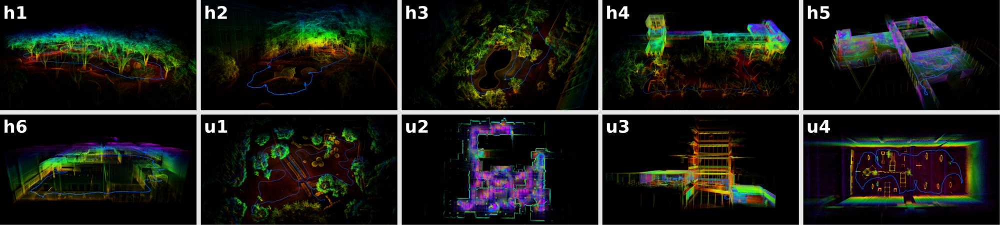

<div align="center">
  <h1>⚡Super-LIO</h1>
  <h2>Super-LIO: A Robust and Efficient LiDAR-Inertial Odometry System with a Compact Mapping Strategy</h2>
  <p><strong>This work has been accepted to <i> IEEE Robotics and Automation Letters (RA-L 2025)</i>.</strong></p>
  <br>

  [](https://github.com/Liansheng-Wang/Super-LIO.git)[](https://arxiv.org/abs/2509.05723)[](https://www.bilibili.com/video/BV11wBeBYEp6)[](https://youtu.be/m9-hl8s5DDw) 
  <!-- [](https://ieeexplore.ieee.org/document/xxxx) -->
</div>


## Overview

<p align="center">
  
</p>


Super-LIO is a robust and efficient LiDAR–Inertial Odometry (LIO) system designed for real-time and large-scale autonomous navigation. It introduces a compact and structured mapping strategy that enables predictable correspondence search and stable state estimation. The system is validated through extensive real-world experiments and comparisons with state-of-the-art methods.


**Contributors**: [Liansheng Wang](https://github.com/Liansheng-Wang), [Xinke Zhang](https://github.com/PSQzzzxk), [Chenhui Li](https://github.com/kermitLHH), [Dongjiao He](https://github.com/Joanna-HE), [Yihan pan](https://github.com/pyh3552), Jianjun Yi.


## Quickly Run

### Requirements

Ubuntu 20.04 · ROS Noetic · Eigen · PCL

### Dependencies

glog · TBB · ros-noetic-jsk-rviz-plugins

```bash
sudo apt install libgoogle-glog-dev libtbb-dev ros-noetic-jsk-rviz-plugins
```

### Build & Run
```bash
git clone https://github.com/Liansheng-Wang/Super-LIO.git
cd Super-LIO
catkin_make

source devel/setup.bash 
roslaunch super_lio Livox_mid360.launch

```

#### 🔁 Relocalization Mode
Super-LIO supports relocalization using a pre-built map, allowing the system to resume localization from a saved map without restarting the mapping process.
This mode is useful for long-term deployment, repeated missions, or recovery after tracking loss.

Before running relocalization, please make sure that:
- A map has been previously saved to disk.

```bash
cd PATH_2_Super-LIO
source devel/setup.bash 
roslaunch super_lio relocation.launch
```


## Datasets
<p align="center">
  
</p>

Super-LIO is evaluated on multiple real-world datasets covering diverse environments,
including indoor, outdoor, and large-scale scenes.

> **TODO**: Dataset download links and detailed descriptions will be provided in the future.


---

## Publications

If your like our projects, please cite us and support us with a star 🌟.
We kindly recommend to cite [our paper](https://arxiv.org/abs/2509.05723) if you find this library useful:

```latex
@article{wang2025super,
  title={Super-LIO: A Robust and Efficient LiDAR-Inertial Odometry System with a Compact Mapping Strategy},
  author={Wang, Liansheng and Zhang, Xinke and Li, Chenhui and He, Dongjiao and Pan, Yihan and Yi, Jianjun},
  journal={arXiv preprint arXiv:2509.05723},
  year={2025}
}
```


